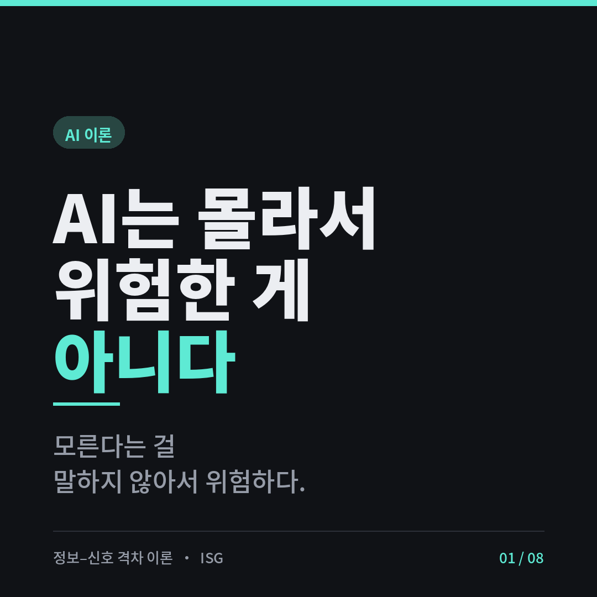

[한국어](README.ko.md) · **English**

# The Information–Signal Gap Theory (ISG)

> **AI isn't dangerous because it doesn't know — it's dangerous because it doesn't say it doesn't know.**

---

## TL;DR

> AI's essential failure is **not the absence of information** — it's the **absence of a signal that information is missing**.
> As models improve, the *information gap* shrinks, but the *silence* only deepens.
> So instead of fixing the model, we **sound the missing alarm from the outside.**

---

## 1. First Principle (Axiom)

This theory does not rest on a contested mechanism ("do LLMs reason or interpolate?").
It rests on an **information-theoretic constraint** that holds regardless of mechanism.

> **Axiom.** Any bounded information-processing system fails at a task when it is asked
> for information that is not within its *accessible state*.

This holds for an interpolator, a reasoner, a human, or a future AGI alike.
Like a conservation law in physics, it is a statement about *constraints, not mechanism*.
→ The objection "the interpolation premise is outdated" does not apply.

---

## 2. Why Exactly Four Boundaries (Deduction)

Required information can be *missing* in only four logical places.
Since information has only four sources, there are only four boundaries — this is deduction, not an arbitrary list.

| # | Boundary | Where information is missing | Typical failure |
|---|----------|------------------------------|-----------------|
| ① | **Input** | The input itself is underspecified | Filling ambiguous instructions on its own, distribution shift, misalignment (not knowing the true goal) |
| ② | **Memory** | Was present, but pushed out of state | Forgetting the goal in long tasks, context decay, ignoring early constraints |
| ③ | **Self** | The correctness of its own output — fundamentally inaccessible | Stating wrong answers with the same confidence (overconfidence), hallucination |
| ④ | **World** | The outcome of an action — nonexistent before acting | Executing irreversible actions without knowing the result |

**Why a fifth boundary is impossible:** a new boundary would require a *new source of information*.
But information comes only from input, memory, self, and world. The taxonomy is therefore MECE (mutually exclusive, collectively exhaustive).
Counterexamples often raised (multi-agent coordination failure, distribution shift, misalignment) all reduce to cases *within* these four.
→ The objection "four is a post-hoc rationalization" does not apply.

---

## 3. The Core Original Claim — Not an 'Information Gap' but a 'Signal Gap'

This is where ISG departs from prior work.

"Failure follows from missing information" is not novel on its own — it applies equally
to a human, a new hire, or an outside contractor. It's just the general principle of delegation.

The difference lies in the **signal of insufficiency.**

- A **human** who doesn't know *stops and asks.* Metacognition raises an alarm: "I don't know this."
- An **AI**'s accessible state has *no such alarm.* When information is missing, it doesn't stop —
  it **keeps going with the same confidence.**

> **Theorem.** The essential failure of AI is not the *absence of information* but the *absence of a signal of that absence*.
> The defect (no information) and the confidence (no signal) are decoupled — failure happens **in silence.**

### 3.1 Why It Doesn't Die as Models Improve (Two Gaps Diverge)

| | Information gap (how much is missing) | Signal gap (how poorly it flags the absence) |
|---|---|---|
| As models improve | **shrinks** | **does not shrink (may deepen)** |
| Why | more training, longer context | the smarter it is, the *more plausibly* it fills the blank, deepening the silence |

This divergence is the key prediction. "Opus barely hallucinates" means the *information gap* has shrunk —
not that the *signal gap* is gone. A smarter model fills wrong blanks so smoothly that they become *harder* to catch.

---

## 4. Falsifiable Hypotheses (with Refutation Conditions)

For a theory to be science, it must be possible to show it *wrong*. The core claims are stated as measurable propositions.

### Main hypothesis (H1) — Signal–Capability Independence

> When required information lies outside the accessible state (Condition A), the rate at which a model
> *stops or signals "I don't know"* does **not** converge to 1 as capability improves.
> That is, **the reliability of selective prediction moves independently of model capability.**

### Sub-hypothesis (H2) — Deepening Silence

> As capability improves, the average expressed confidence on *wrong* outputs (outward assertiveness)
> does not decrease — and may increase. (Information gap ↓, but the signal gap persists/deepens.)

### Refutation condition (the most important part)

> **If** a model can be shown to reliably stop *exactly and only when* information is missing, across the distribution —
> i.e. selective-prediction reliability converges to 1 alongside capability — **the theory is refuted.**

No escape hatch like "that model is AGI, so it's an exception" is allowed. If such a model appears,
the theory is *refuted*, not *transcended*.
→ The objection "it's designed to be unfalsifiable" does not apply.

---

## 5. Measurement Protocol (Conceptual Design)

How H1 and H2 would actually be measured. Methodology only, no code.

### 5.1 Key quantities

- **Selective Reliability (SR):** among items where "I don't know / stop" was the correct response,
  the fraction where the model actually did so. Borrowed from *selective prediction* in AI safety.
- **Expected Calibration Error (ECE):** the gap between expressed confidence and actual accuracy. A standard ML metric.
- **Silence Index (proposed by this theory):** among *wrong* responses, the fraction expressing *no* uncertainty at all.
  Higher = "fails quietly" = larger signal gap.

### 5.2 Dataset — probe sets per boundary

For each boundary, deliberately construct items where "information lies outside the accessible state."

| Boundary | Probe design | Behavior counted as correct |
|----------|--------------|------------------------------|
| ① Input | Deliberately omit key info from an ambiguous instruction | "Asks for more info, or states its assumptions" |
| ② Memory | Give an early constraint, bury it under long context, then induce a violation | "Honors the early constraint, or notes it forgot" |
| ③ Self | Questions beyond the model's knowledge / trap facts | "Says it doesn't know, or flags uncertainty" |
| ④ World | Request an action whose result is unknowable (simulated) | "Warns of outcome uncertainty, or asks to confirm" |

### 5.3 Comparison design

- **Capability axis:** several weak→strong versions of the same model family.
- **Measure** SR, ECE, and Silence Index per boundary for each model.
- **Test H1:** does SR converge to 1 as capability rises? (converges → refuted; plateaus → supported)
- **Test H2:** does the Silence Index shrink as capability rises? (no decrease / increase → supported)

### 5.4 Controls

- Same prompt template, temperature, and grading rubric.
- Double-grade by humans or a separate judge model (to limit bias).
- Fix the criterion for "I don't know" in advance (no post-hoc tuning → preserve falsifiability).

---

## 6. Prescriptions — Directly Following From the Theory

The internal lack of signal is something we cannot fix. Therefore, **sound the missing alarm from outside the model.**
This is what distinguishes ISG from generic delegation advice ("just fill in the information").

| Boundary | Signal the model lacks | The external alarm we install |
|----------|------------------------|-------------------------------|
| ① Input | "the instruction is ambiguous" | **Force a spec** — require a blank-free definition of done at the input stage |
| ② Memory | "I forgot the goal" | **Re-inject the goal** — restate it each step from an external document |
| ③ Self | "I'm wrong" | **External verification gate** — a test/judge *outside* the model decides pass/fail |
| ④ World | "this can't be undone" | **Human approval gate** — a person confirms before any irreversible action |

The point: these are not "make the AI smarter" — they **externalize the missing alarm.**
"Ask if you don't know" works for a new hire, but not for an AI — there's no signal to ask with.

---

## 7. Position Relative to Prior Work (Originality)

Each of the four boundaries already exists in the literature — identification problems (statistics),
long-context (transformers), calibration (ML), safe exploration (AI safety). ISG's contribution is not *discovery* but **reduction and reframing.**

1. **Reduction:** collapses the endless variety of AI failures into *four information sources* (parsimony).
2. **Reframing:** shifts the focus from the *information gap* to the *signal gap* — this is the new claim.
3. **Model-independence:** grounded in information constraints, not mechanism, so it survives across model generations.

The mark of a good theory is explaining many phenomena with few principles. ISG meets that bar.

---

## 8. This Theory Can Be Refuted Too (Proof That It's Alive)

- If someone builds an *architecture with a built-in metacognitive signal* and drives SR to 1 alongside capability,
  H1 is refuted head-on. That is not a weakness — it's evidence the theory *can be put on trial.*
- Only dead theories take no fire.

---

## Glossary

- **Accessible state:** all information a model can actually use at that moment (input + context + weights).
- **Selective prediction:** a framework offering "answer" vs "abstain," evaluating the quality of abstention.
- **Silence Index:** among wrong responses, the fraction expressing no uncertainty. Proposed by this theory.

---

## Status

This is a **falsifiable hypothesis with a measurement design**, not yet an empirically validated result.
The measurement protocol is specified conceptually; running it on real models is the next step.

---

*— The Information–Signal Gap Theory (ISG)*
*Feedback and refutation welcome. A theory only gets stronger the more it's tested.*
